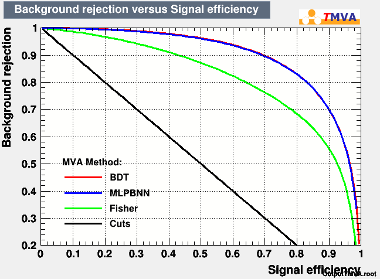
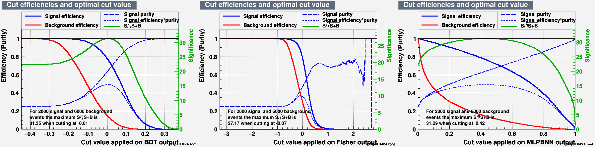
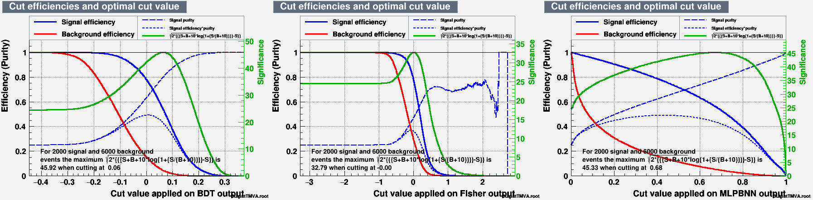

# Higgs Machine Learning challenge with Higgs to tau-tau events

## Introduction
This repository contains the code for the "multivariate analysis" of simulated data for Higgs Boson decaying in two tau leptons with three major backgrounds.

This data is obtained from [opendataCERN](https://opendata.cern.ch/record/328), where it was published for "Machine Learning Challenge".

The dataset contains 818238 events.

## Classifiers Used
For more details, please refer: [TMVA USER GUIDE](https://root.cern/download/doc/tmva/TMVAUsersGuide.pdf)

- **Cuts:** Automatic rectangular cut optimization

- **BDT:** Boosted Decision Trees

- **Fisher:** Fisher's linear discriminant

- **MLPBNN:** Multi-Layer Perceptron with Bayesian regulator  # I used 500 epochs which took around 2 hrs 30 minutes. You can reduce the number of epochs or remove this classifier.

## Results

**ROC Curve**



**Classifiers cut efficiencies**

This result, using the default significance formula written for the TMVA classifier cut efficiencies.



The result below uses Asimov's Approximate Median Significance (AMS) formula,



- **Dataset** folder contains all the plots and weight results generated after classification.


## Code Description

- **prepare_dataset.cpp:** This macro is written to prepare signal and background data trees separately.

- **training_test.cpp:** This macro is used for training and test purposes. Comments are provided in the code for better understanding.


## Getting Started

First, clone the repository,
```bash
git clone https://github.com/Alam-Danish/Higgs_TMVA.git
```
Then download the Higgs data from [opendataCERN](https://opendata.cern.ch/record/328) and extract it in the data folder in the repo.

Now, to prepare the signal and background dataset. Run **prepare_dataset.cpp** macro using ROOT.
```bash
root prepare_dataset.cpp
```

Now initialize the training and testing of data by running **training_test.cpp** macro.
```bash
root training_test.cpp
```
The above macro will create an output file named **OutputTMVA.root**, which can be analyzed using TMVAGui.
To run TMVAGui,
```bash
root
TMVA::TMVAGui("OutputTMVA.root")    # Here, OutputTMVA.root is the file name which we want to analyze with TMVAGui.
```
If you look at the classifier cut efficiencies now, It will be calculated using an approximate formula: $Z= S/\sqrt{S+B}$

As explained in the Official documentation, we can estimate the expected discovery significance with the following formula: $$Z = \sqrt{2\cdot\left((S+B+B_r)\cdot log\left(1+\frac{S}{B+B_r}\right)-S\right)}$$

Where $S, B$, and $B_r=10$ are the true positive, false positive rates and constant regularisation term, respectively.

Now run the function responsible for the efficiencies and significance calculation with this new formula.
```bash
root
TTMVA::mvaeffs("dataset", "OutputTMVA.root", 2000, 6000, true, "sqrt(2*(((S+B+10)*log(1+(S/(B+10))))-S))")    #void mvaeffs(TString dataset, TString fin = "OutputTMVA.root", Float_t nSignal = 2000, Float_t nBackground = 6000, Bool_t useTMVAStyle = kTRUE, TString formula = "sqrt(2*(((S+B+10)*log(1+(S/(B+10))))-S))")
